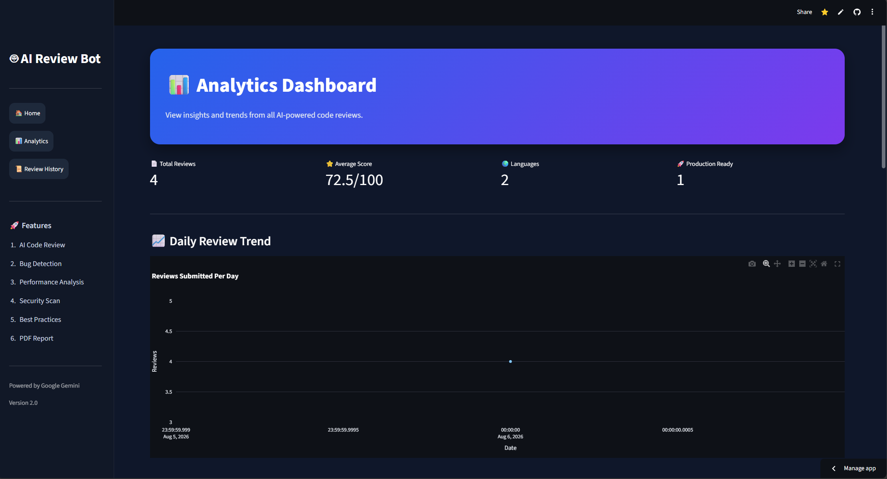
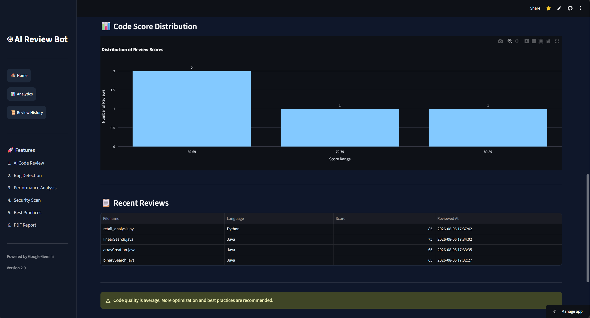

# AI-Powered-Code-Review-Bot
AI-powered code review platform that analyzes source code, detects bugs, evaluates quality, and provides intelligent improvement suggestions using Gemini AI.


## 🚀 Live Demo

https://rvrrithwik28aipoweredcodereviewbot.streamlit.app/

# 🤖 Overview

An intelligent code analysis platform built with **Python, Streamlit, Gemini AI, SQLite, and Plotly** that automatically reviews source code, detects potential issues, evaluates code quality, and provides actionable improvement suggestions.

## 🚀 Features

* 🔍 AI-Powered Code Review using Gemini AI
* 📊 Code Quality Scoring System
* 🐞 Bug Detection & Analysis
* 🔒 Security Vulnerability Assessment
* ⚡ Performance Optimization Suggestions
* 📝 Best Practice Recommendations
* 📄 Downloadable Review Reports
* 🗄️ SQLite-Based Review History Storage
* 📈 Analytics Dashboard with Visualizations
* 🌐 Multi-Page Streamlit Application
* 💻 Supports Python, Java, and SQL Files

---

## 🛠️ Tech Stack

### Frontend

* Streamlit

### Backend

* Python

### AI Model

* Google Gemini AI

### Database

* SQLite

### Visualization

* Plotly

### Libraries

* Pandas
* ReportLab
* Python Dotenv

---

## 📂 Project Structure

```text
AI_Code_Review_Bot/

├── app.py
├── review_engine.py
├── database.py
├── utils.py
├── report_generator.py
├── reviews.db
├── requirements.txt
│
├── pages/
│   ├── Analytics.py
│   └── Review_History.py
│
├── screenshots/
│
└── README.md
```

---

## ⚙️ Installation

### Clone Repository

```bash
cd AI-Powered-Code-Review-Bot
```

### Create Virtual Environment

```bash
python -m venv venv
```

Activate Environment

#### Windows

```bash
venv\Scripts\activate
```

### Install Dependencies

```bash
pip install -r requirements.txt
```

### Configure Environment Variables

Create a `.env` file:

### Run Application

```bash
python -m streamlit run app.py
```

---

## 📊 Analytics Dashboard

The application includes:

* Total Reviews
* Average Review Score
* Score Distribution Analysis
* File Type Distribution
* Review History Tracking

---

## 🎯 Learning Outcomes

This project demonstrates:

* Generative AI Integration
* Prompt Engineering
* Full Stack Python Development
* Database Management
* Data Visualization
* Software Quality Analysis
* Streamlit Application Development

---

## ⭐ Future Enhancements

* GitHub Repository Review Integration
* Multi-Language Support
* CI/CD Integration
* Team Collaboration Features
* Cloud Deployment
* Advanced Security Audits
* Code Complexity Analysis

---

# 📸 Application Screenshots

## 🏠 Home Page


---

## 📊 Analytics Dashboard



---

## 🌍 Programming Language Distribution


---

## 📈 Code Score Distribution



---

## 📜 Review History


---

## 🗂 Review Records


---

# 👨‍💻 Author

**R. Venkata Rama Rithwik**

B.Tech Computer Science Engineering  
Vellore Institute of Technology (VIT)

GitHub:
https://github.com/RVRRITHWIK28

LinkedIn:
https://linkedin.com/in/rvrrithwik28

---

⭐ If you found this project useful, consider giving it a star.